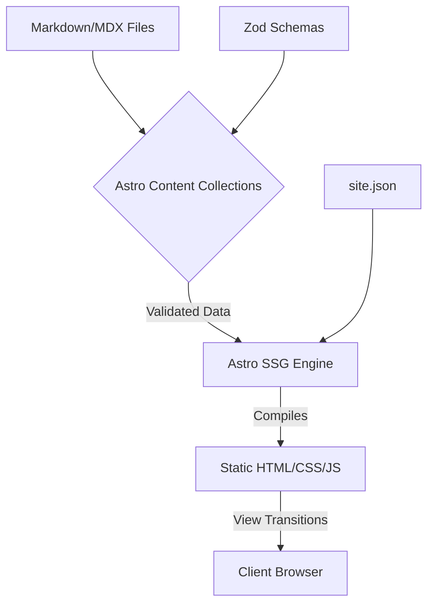
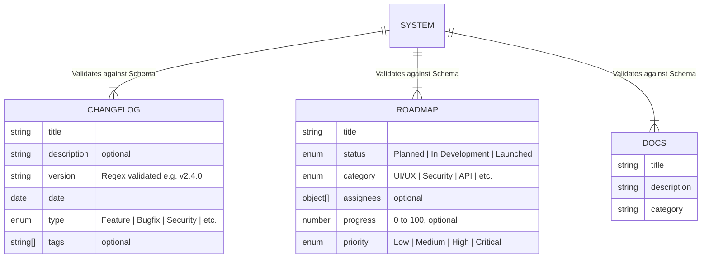

# Arquitectura de Product OS: Unificación Estática de la Comunicación de Producto

[📸 Captura: Logo minimalista de Product OS en el centro]

El desarrollo de software requiere más que la sola implementación de código; exige una estructura informativa coherente para comunicar su estado y evolución. Frecuentemente, el registro de versiones, la planificación a futuro y la documentación técnica residen en sistemas separados, obligando a los usuarios e ingenieros a buscar contexto a través de múltiples herramientas.

Para resolver esta fragmentación operativa, diseñé **Product OS**. Esta herramienta es una infraestructura centralizada que consolida el registro de cambios (Changelog), la hoja de ruta de desarrollo (Roadmap) y la base de conocimiento técnica (Docs). La utilidad principal de este proyecto es reducir la fricción en la transferencia de conocimiento, asegurando que cualquier actor tenga acceso estructurado y validado a la realidad del producto desde una única interfaz determinista.

---

## Lógica de Negocio y Flujos Operativos

La plataforma no es una aplicación transaccional, sino un sistema de consulta de datos altamente estructurado. Se divide en tres flujos informativos integrados:

1.  **Auditoría de Actualizaciones (Changelog):** El sistema procesa y renderiza un historial cronológico estricto. Cada versión (ej., `v1.2.0`) es categorizada semánticamente (Feature, Bugfix, Security) y validada. Permite al usuario reconstruir el historial evolutivo del software de forma inmediata.
2.  **Visibilidad de Planificación (Roadmap):** Se gestiona el ciclo de vida de las iniciativas futuras. El flujo permite visualizar tareas mediante estados predefinidos (`Under Consideration`, `Planned`, `In Development`, `Launched`), mostrando metadatos como prioridad, categoría, progreso y desarrolladores asignados.
3.  **Transferencia de Conocimiento (Docs):** La documentación se compila estáticamente dentro del portal. Los usuarios pueden transitar desde el descubrimiento de una característica en el Changelog hacia su guía de implementación en los Docs, compartiendo el mismo enrutamiento y estado del cliente.

[📸 Captura: Interfaz principal mostrando la navegación entre las tres dimensiones informativas del producto]

---

## Análisis Arquitectónico y Modelado

El portal fue construido priorizando tiempos de carga instantáneos, First Contentful Paint (FCP) mínimo y un SEO estático robusto. Se aparta deliberadamente de los CMS dinámicos tradicionales o arquitecturas SPA masivas en favor de una solución generada estáticamente (SSG) y fuertemente validada en el backend de compilación.

### Arquitectura General y Patrones

El proyecto adopta un patrón arquitectónico basado en **Generación de Sitios Estáticos (SSG) con Arquitectura de Islas**, sustentado en Astro.

*   **Ruteo en el Cliente (Client-Side Routing):** Para mitigar la navegación tradicional de múltiples cargas completas (Multi-Page Application), se implementaron las **Astro View Transitions**. Esto proporciona una navegación que simula una SPA, preservando el estado de la UI (como el modo oscuro `dark:` mediante el `ThemeToggle`) sin sobrecargar el hilo principal.
*   **Separación de Metadatos Globales:** Los datos genéricos del sitio (nombre, logo, enlaces sociales) están desacoplados de los componentes y almacenados estáticamente en `src/data/site.json`, implementando un patrón de configuración centralizada mediante alias de rutas (`@/data`).
*   **Gestión de Formularios Serverless:** La recolección de retroalimentación de usuarios (`FeedbackForm.astro`) se gestiona delegando la captura de envíos a la infraestructura de CloudCannon (vía atributos ocultos como `inbox_key`), manteniendo la pureza estática del frontend sin requerir un backend propio.

### Modelado de Datos y Validación Estricta

La aplicación prescinde de una base de datos relacional. Implementa un patrón de **Content Collections**, donde los datos actúan como el modelo de dominio principal, gestionado a nivel del sistema de archivos mediante Markdown (Changelog/Roadmap) y MDX (Docs).

La integridad del dominio es garantizada *antes* del tiempo de compilación utilizando esquemas de validación estricta con **Zod** en `src/content.config.ts`. Si un documento Markdown contiene un estado de Roadmap inválido o una versión mal formateada, el pipeline de compilación falla explícitamente, previniendo errores en producción.

### Stack Tecnológico

| Herramienta | Función Arquitectónica | Justificación Técnica |
| :--- | :--- | :--- |
| **Astro (v6+)** | Core Engine / Framework SSG | Arquitectura zero-JS por defecto, soporte nativo de Content Collections e integración directa de View Transitions. |
| **TypeScript & Zod** | Tipado y Validación de Dominio | Garantiza que las propiedades inyectadas desde el CMS (archivos locales) cumplan estrictamente los contratos de datos en tiempo de compilación. |
| **Tailwind CSS (v4)** | Sistema de Estilos Utilitario | Eliminación de CSS no utilizado, estandarización de tokens de diseño y manejo nativo de clases `.dark` para esquemas de color invertidos. |
| **GSAP** | Motor de Micro-Interacciones | Orquestación imperativa de animaciones complejas (como la barra de progreso de inicio). Envuelto en los eventos `astro:page-load` para persistencia durante las transiciones de vista. |
| **Biome.js** | Linter y Formatter | Unificación del análisis estático del código fuente. Reemplaza la cadena de herramientas tradicional (ESLint + Prettier) por un binario único ultrarrápido escrito en Rust. |

---

La conjunción de Astro, la validación estricta de dominios con Zod y la entrega estática demuestran que la consolidación de la información de producto no requiere infraestructuras pesadas. Esta arquitectura minimiza drásticamente los vectores de ataque, abstrae la complejidad del escalamiento de bases de datos y asegura que cada compilación resulte en un artefacto determinista, inmutable y altamente performante.